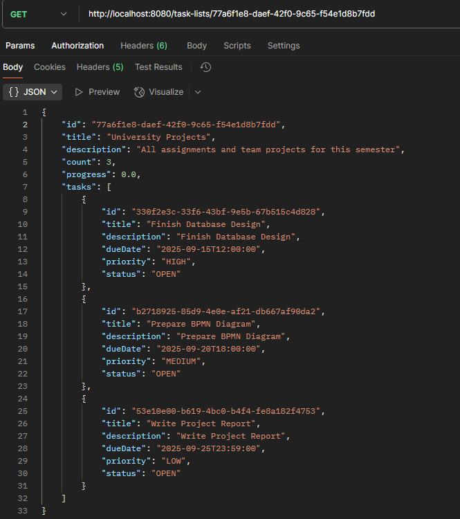
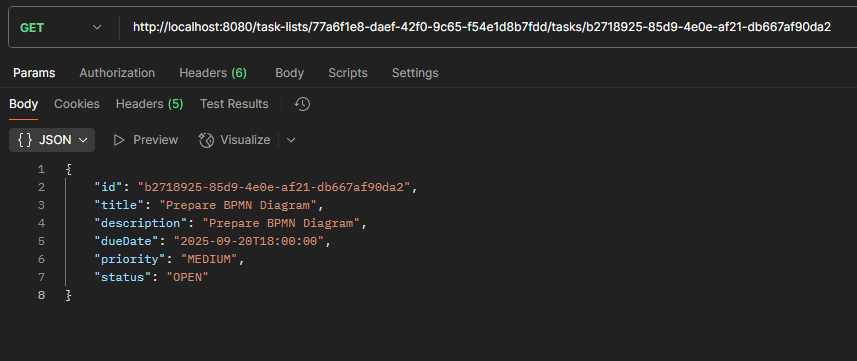
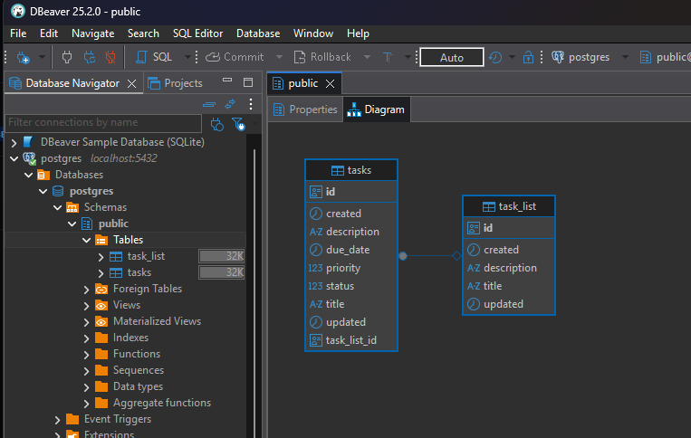

# 📌 Task Tracker Backend

A **Spring Boot** based task management backend application.  
This project allows users to create task lists, add tasks into them, update their progress, and manage daily productivity.  
The backend is designed with **clean architecture principles** (DTOs, Mappers, Services, Controllers) and uses **PostgreSQL (via Docker)** for persistence.

---

## 🚀 Features
- Manage **Task Lists** (CRUD operations)
- Manage **Tasks** inside lists (CRUD operations)
- Track **task status** (`OPEN` / `CLOSED`)
- Define **priority levels** (`HIGH`, `MEDIUM`, `LOW`)
- Automatic **progress calculation** for each list
- **Global Exception Handling** returning structured JSON responses
- **H2 in-memory database** for testing
- REST API tested with **Postman**
- Database visualization with **DBeaver**

---

## 🛠️ Tech Stack
- **Java 17+**
- **Spring Boot** (Web, Data JPA)
- **PostgreSQL** (Dockerized)
- **H2** (Test database)
- **Maven**
- **DBeaver** (DB visualization)
- **Postman** (API testing)

---

## 📂 Project Structure
```
src/main/java/com/doruk/task
 ├── domain
 │    ├── entities (Task, TaskList, enums)
 │    ├── dto (TaskDto, TaskListDto, ErrorResponse)
 ├── mappers (TaskMapper, TaskListMapper)
 ├── repositories (TaskRepository, TaskListRepository)
 ├── services (interfaces + implementations)
 ├── controllers (TaskController, TaskListController, GlobalExceptionHandler)
```

---

## ⚙️ Getting Started

### 1. Clone Repository
```bash
git clone https://github.com/dorukmenguverdi/task-tracker-backend.git
cd task-tracker-backend
```

### 2. Run PostgreSQL with Docker
```bash
docker run --name task-db -e POSTGRES_PASSWORD=myfullsecretpassword -p 5432:5432 -d postgres
```

### 3. Configure Application
Copy the example config and set your own DB credentials:
```bash
cp src/main/resources/application-example.yml src/main/resources/application.yml
```

### 4. Run the App
```bash
mvn spring-boot:run
```

Application will start on:  
👉 `http://localhost:8080`

---

## 📬 API Endpoints

### Task Lists
- `GET /task-lists` → list all task lists  
- `POST /task-lists` → create new task list  
- `GET /task-lists/{task_list_id}` → get one task list  
- `PUT /task-lists/{task_list_id}` → update task list  
- `DELETE /task-lists/{task_list_id}` → delete task list  

### Tasks
- `GET /task-lists/{task_list_id}/tasks` → list tasks in a list  
- `POST /task-lists/{task_list_id}/tasks` → create new task  
- `GET /task-lists/{task_list_id}/tasks/{task_id}` → get one task  
- `PUT /task-lists/{task_list_id}/tasks/{task_id}` → update task  
- `DELETE /task-lists/{task_list_id}/tasks/{task_id}` → delete task  

---

## 📸 Screenshots

### Postman – Create TaskList


### Postman – List Tasks


### Database Schema (DBeaver)


---

